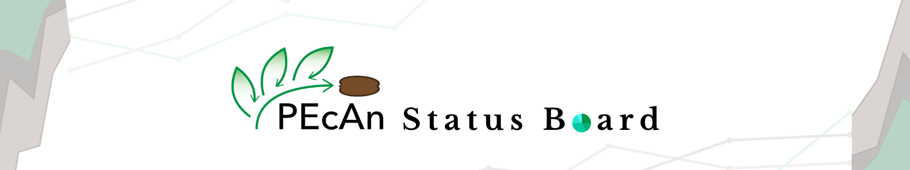

<h1 align="center">PEcAn Satus Board</h1>

<div align="center">
  
[](https://github.com/PecanProject/pecan-status-board/actions/workflows/auto-schedule.yaml)
[](https://github.com/PecanProject/pecan-status-board/actions/workflows/push-ci.yaml)
[](https://github.com/PecanProject/pecan-status-board/actions/workflows/manual-test.yaml)


  
</div>

## About The Project



The PEcAn Status Board is a dashboard that monitors the [Predictive Ecosystem Analyzer (PEcAn)](https://github.com/PecanProject/pecan) system and checks whether sites, models, met are working or not using different forms of visualizations.

- The dashboard uses the [PEcAn API](https://github.com/PecanProject/rpecanapi) for getting the results from the server
- It runs an automatic test of the system at 06:05 UTC using [GitHub Actions](https://github.com/PecanProject/pecan-status-board/tree/main/.github/workflows)
- The status board has the visualizations which represents the total success percentage of Sites, Models and Mets.

## Installation

The PEcan Status Board can be installed locally from [GitHub](https://github.com/PecanProject/pecan-status-board) with:

``` r
# install.packages("devtools")
devtools::install_github("PecanProject/pecan-status-board")
```
``` r 
library("statusboard")
```
### Running The Dashboard
``` r
# Run this code to start the dashboard locally
statusboard::run_app()

```
## Visualization

Data Visualization refers to the graphical representation of information and data in the form of a graph, or chart, or bar, or any other format. The purpose of Data Visualization is to convey information and results quickly and easily.

### Plots Used in PEcAn Status Board

- **Bar Chart:** Bar graphs are visual representations of data in the shape of vertical or horizontal rectangular bars, with bar length proportional to data measure.

- **Scatter Plot:** Scatter plot is a type of chart used to display and observe the relationship between variables where dots indicate the values of variables.

- **Pie Chart:** Pie Chart represents the data in the circular graph where the relative size of data is displayed in the form of slices.

- **Heatmap:**  Heatmaps are also a form of graphical representation that uses color-coding to represent different values.

## Overview of The Dashboard

The PEcAn Status board currently has three different tabs, which help monitor the PEcAn system more efficiently and quickly.

### Dashboard 

The dashboard tab has the visualization of models, sites, Mets, and their success percentage, which represents ṭhe total success of every single Model, Sites, and Mets.


- **Scatter Plot:** The scatter plot shows which sites and models are running perfectly. The green dots represent the successful tests, the red dots represents all the failed tests on that particular model and site, and the brown dot appears when there are both successful and failed tests on the same sites and models with different input.

- **Bar Plot:** The bar graphs in the dashboard tab represent the total success percentages of each Models, Sites and Mets using the final status generated by the test run.

### Test


The test tab is designed to check the report generated after the test run. The first data table represents the short summary of the last run, and it shows if everything is working or not in the system.

### Report 

The report tab has two different sections, one for the weekly status of the test run and the second for checking the details of the workflows.


- **Weekly Status:** The weekly status section has the details of the run for a week, It has pie charts which show the counts of total success & failures of the test, and a data table for checking the time difference and status of the tests.


- **Workflow Status:** The workflow status section is designed to keep a track of the workflows using heatmaps and data tables. The data table displays the time difference of the stages & the details of Models, Sites, and Mets of the workflows.

## License

Distributed under the NCSA Open Source License. See `LICENSE` for more information.

## Feedback

*"We all need people who will give us feedback. That’s how we improve."* **- Bill Gates**

We would love to hear from you if you are experiencing any issues or have any suggestions. Please [click here to raise an issue](https://github.com/PecanProject/pecan-status-board/issues/new).
